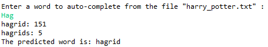

# Predictive Text Auto-completion
Trie tree model for auto-completing words from text

## Running Program

1. Clone repository

2. Set FILE_NAME to the file containing your test

3. Run TextPredictor.java

4. Enter words that you would like to auto-complete
